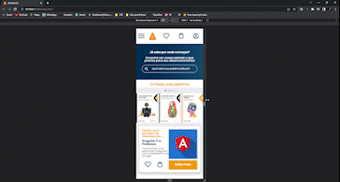
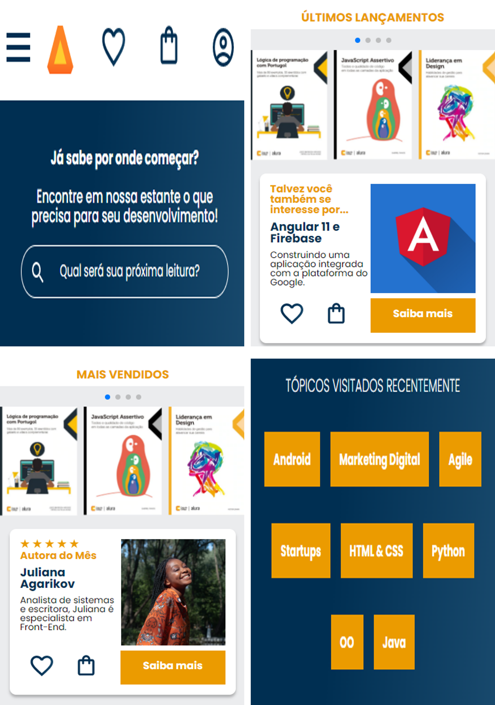

# AluraBook

<h3>AluraBook é uma página de vendas de livros</h3>
 

## Demonstração

    </img>

## Screenshots
</img>
 

## Deploy

**Link para testes:** <a target="_blank" href="https://alurabook-lime.vercel.app/">alurabook-lime.vercel.app/</a>

## Stack utilizada

**Front-end:** HTML e CSS

## Aprendizados

Densenvolvendo esse projeto, conseguir entender as diferentes maneiras de posicionar os elementos em uma página utilizando o flexbox, aprendi a organizar meus componentes nomeando e separando cada um deles para que a manutenção da página seja prática e eficiente. Praticando assim o Mobile-First.
